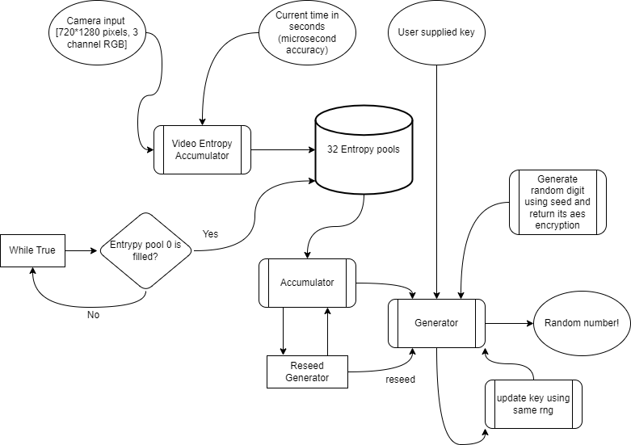

# FortunaCam
A secure random number generator that utilizes a video camera as the primary source of randomness. The system leverages a true random seed obtained from the video camera, ensuring a high level of entropy. To provide reliable and secure cryptography functions, I implemented the Fortuna algorithm using the PyCrypto library. The Fortuna algorithm incorporates cryptographic algorithms such as SHA-256 and AES, enhancing the system's security and reliability. The random number generator system ensures the generation of unpredictable and unbiased random numbers, making it suitable for various applications that require randomness, such as cryptography, simulations, and gaming. This project not only addresses the need for secure random number generation but also showcases the effective utilization of cryptographic algorithms for robust and reliable operations.

## Flowchart
The following figure shows the workflow of the project.

